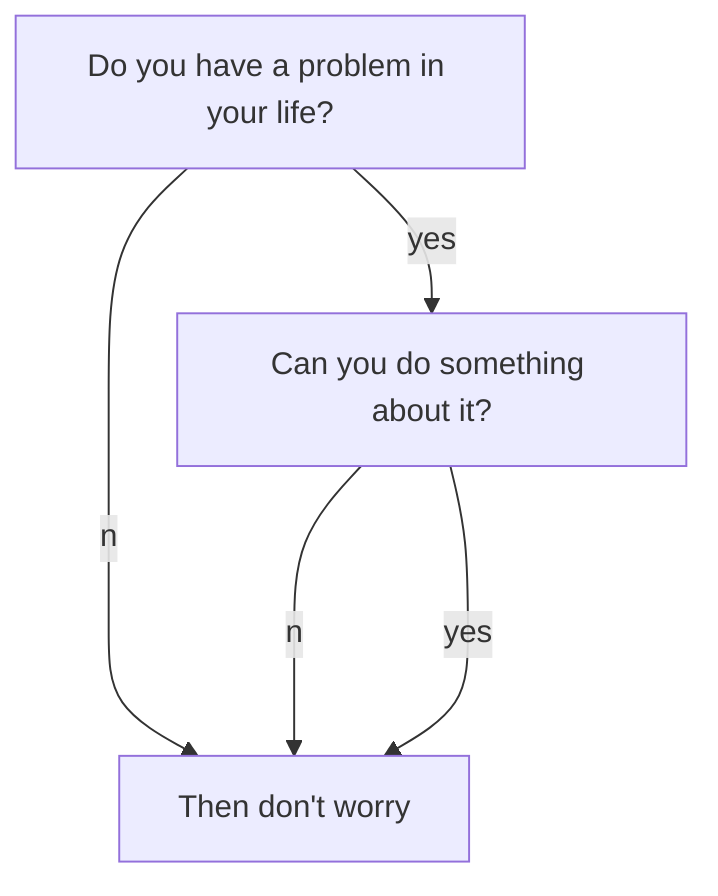

Hey, welcome to this blog. Here I will post topics I care about and thinks I work on! :ghost: :ghost: :ghost:

Here I is a playground for cool techniques to use

# Theorems and Proofs

[def]
A set $C$ is *convex* if for all
$x,y \in C$ and for all
$\alpha \in [0,1]$ the point
$\alpha x + (1-\alpha) y \in C$.
[/def]

[theorem]
A set $C$ is *convex* if for all
$x,y \in C$ and for all
$\alpha \in [0,1]$ the point
$\alpha x + (1-\alpha) y \in C$.
[/theorem]

[proof]
A set $C$ is *convex* if for all
$x,y \in C$ and for all
$\alpha \in [0,1]$ the point
$\alpha x + (1-\alpha) y \in C$.
[/proof]

[lemma]
A set $C$ is *convex* if for all
$x,y \in C$ and for all
$\alpha \in [0,1]$ the point
$\alpha x + (1-\alpha) y \in C$.
[/lemma]

[theorem]
A set $C$ is *convex* if for all
$x,y \in C$ and for all
$\alpha \in [0,1]$ the point
$\alpha x + (1-\alpha) y \in C$.
[/theorem]

[proof]
A set $C$ is *convex* if for all
$x,y \in C$ and for all
$\alpha \in [0,1]$ the point
$\alpha x + (1-\alpha) y \in C$.
[/proof]

# Videos



# Mermaid

## Interactive coding 

Use trinket!


# your code here


## Boxes: Cards

  

    

      <h4>Photograph</h4>
    

    
...

  



<!--more-->

Info Text.
{:.info}

---

