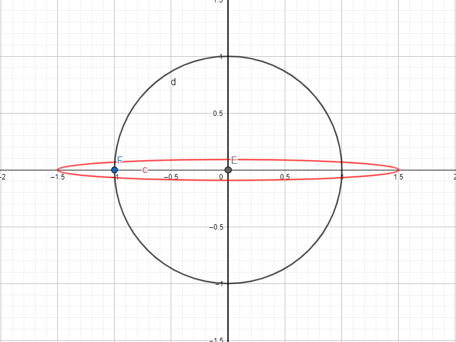

Here we will investigate how certain pertubations of the paramters of a probability distribution will change the distribution by means of the KL divergence. 
Note this is not as easy as just calculating the distance between the parameters. A small changes within some parameters can change the shape of a distributions a lot where others may only have a small influence.

So let's consider two parametric distributions $p_\phi (\theta)$ and $p_{\phi'}(\theta)$. We are interested how pertubations of the parameter $\phi$ will change it. So let's consider $\phi' = \phi + \delta$ and investigate
$D(p_\phi || p_{\phi + \delta})$ for some divergence measure $D$.

Unfortunatly this quantity is generally intractable for most divergence measures. Thus we will consider some approximation more general approximations. 

## The KL divergence and it's relation to the Fisher information

The KL divergence is defined as
$$D_{KL}(p_\phi || p_{\phi + \delta}) = \mathbb{E}_{p_\phi} \left[ \log \frac{p_{\phi}(x)}{p_{\phi + \delta}(x)} \right]$$

For certain parameteric families this quantity is closed-form i.e. using the Gaussian family. Yet for generality let's consider a second order Taylor expansion of it around $\phi$ evaluated for $\phi' = \phi + \delta$  i.e.

$$ \begin{aligned} D_{KL}(p_\phi || p_{\phi'}) \approx \ & D_{KL}(p_\phi || p_{\phi}) \ + \\ &(\nabla_{\phi'}^TD_{KL}(p_\phi || p_{\phi'})\mid_{\phi'=\phi}) (\phi' - \phi) \ + \\ &\frac{1}{2}(\phi' - \phi)^T\left(\nabla_{\phi'}\nabla_{\phi'}^TD_{KL}(p_\phi || p_{\phi'})\mid_{\phi'=\phi}\right) (\phi' - \phi) \end{aligned} $$

This can be simplified drastically, because  $(\phi' - \phi) =  (\phi + \delta - \phi) =  \delta$ and $D_{KL}(p_\phi || p_{\phi})=0$. Let's consider the first term

$$ \begin{aligned} \nabla_{\phi'}D_{KL}(p_\phi || p_{\phi'}) & = \nabla_{\phi'} \mathbb{E}_{p_\phi} \left[ \log \frac{p_{\phi}(x)}{p_{\phi'}(x)} \right] \\ &= \mathbb{E}_{p_\phi} \left[ \nabla_{\phi'}\log p_{\phi}(x) - \nabla_{\phi'}\log p_{\phi'}(x) \right] \\&= -\mathbb{E}_{p_\phi} \left[ \nabla_{\phi'}\log p_{\phi'}(x) \right] \end{aligned}$$

Thus if we evaluate the gradient at $\phi' = \phi$, we obtain a expectation over the score! As we learned in the last article we get
$$ -\mathbb{E}_{p_\phi} \left[ \nabla_{\phi'}\log p_{\phi'}(x) \right]\mid_{\phi' = \phi} = -\mathbb{E}_{p_\phi} \left[ \nabla_{\phi}\log p_{\phi}(x) \right] = 0$$
hence the first order term vanishes. Be $H_{\log p_{\phi'}(x)} = \nabla_{\phi'}^T\nabla_{\phi'} \log p_{\phi'}(x)$ the Hessian matrix. Then we can write Taylor expansion as follows:
$$ D_{KL}(p_\phi || p_{\phi + \delta}) \approx \frac{1}{2} \delta^T \mathbb{E}_{p_\phi}\left[  -H_{\log p_{\phi'}(x)}\right] \delta$$
and as we elaborated last time if some regularity conditons hold (that we can exchange integration and differentiation) then $\mathbb{E}_{p_\phi}\left[ - H_{\log p_{\phi'}(x)} \right]= F(\phi)$ where $F(\phi)$ denotes the Fisher information matrix and hence 
$$ D_{KL}(p_\phi || p_{\phi + \delta}) \approx \frac{1}{2}\delta^T F(\phi) \delta$$

For small pertubations this will be a rather good approximation. Thus let's consider what happends if we have white noise pertubations $\delta \sim \mathcal{N}(0, \sigma^2 I)$ for some small $\sigma^2$. An interesting quantity would then be $\mathbb{E}_{\delta}[D_{KL}(p_\phi || p_{\phi + \delta})]$, which measure what effect this 

> **Claim:** For $\delta \sim \mathcal{N}(0, \sigma^2 I)$ it holds that
> $$  \mathbb{E}_{\delta}[D_{KL}(p_\phi || p_{\phi + \delta})] \approx \frac{1}{2}\sigma^2 tr(F(\phi))$$
> 
> **Proof:** 
> Using the Taylor approximation introduce above we know that
> $$ \mathbb{E}_{\delta}[D_{KL}(p_\phi || p_{\phi + \delta})] \approx \frac{1}{2}\mathbb{E}_{\delta}[\delta^T F(\phi) \delta ] $$
> Thus we require the expecation of a quadratic form. This can easily be calculated using
> $$ \mathbb{E}_{\delta}[\delta^T F(\phi) \delta ] = \mathbb{E}_{\delta}\left[tr(F(\phi)\delta \delta^T) \right] = tr(F(\phi)\sigma^2 I) = \sigma^2 \cdot tr(F(\phi))$$
> The claim follows directly

So this makes a lot of sense, the distributions does not change much if $\delta$ has low variance (as it's mean is zero). For fixed variance it soley depends on the trace of the Fisher information. Recall that the Fisher information is a metric on how much we can learn about the parameter from samples of the distribution. So if it is large, then it is easy "learnable". But consequently must have a large influnce on the shape of the distribution and thus pertubations strongly affect it. So let's also generalized this result to different pertubations!

> **Claim:** For any $\delta \sim p(\delta)$ with existing mean $\mu$ and covariance $\Sigma$, it holds that
> $$  \mathbb{E}_{\delta}[D_{KL}(p_\phi || p_{\phi + \delta})] \approx \frac{1}{2} tr(F(\phi)\Sigma) + \frac{1}{2}\mu F(\phi) \mu^T  $$
> 
> **Proof:** 
> Using the Taylor approximation introduce above we know that
> $$ \mathbb{E}_{\delta}[D_{KL}(p_\phi || p_{\phi + \delta})] \approx \frac{1}{2}\mathbb{E}_{\delta}[\delta^T F(\phi) \delta ] $$
> Thus we require the expecation of a quadratic form. This can easily be calculated using
> $$ \mathbb{E}_{\delta}[\delta^T F(\phi) \delta ] = \mathbb{E}_{\delta}[tr(\delta^T F(\phi) \delta) ] = \mathbb{E}_{\delta}[tr(F(\phi) \delta \delta^T) ] =tr(F(\phi)  \mathbb{E}_{\delta}[\delta \delta^T]) = tr(F(\phi)  (\Sigma + \mu \mu^T)) = tr(F(\phi)\Sigma) + \mu F(\phi) \mu^T  

Thus the Fisher information is involved in both the mean and the covariance! Note a Gaussian "attack" model maybe less realistic, we essentially try to be robust for pertubations in any directions of a certain expected length. Typically an attack tries to find a **single vector** $v$ which maximizes some attack criteria. For example a reasonable scenario would be that the attacker tries to exactly maximize the direction increasing the KL divergence between the distribution the most i.e. 

$$ \delta = \argmax_{\delta: ||\delta|| = \epsilon} D_{KL}(p_\phi || p_{\phi + \delta}) \approx \argmax_{\delta: ||\delta|| = \epsilon} \frac{1}{2} \delta^T F(\phi) \delta = \argmax_{\delta: ||\delta|| = \epsilon} \frac{\delta^T F(\phi) \delta }{\epsilon^2} = \argmax_{\delta: ||\delta|| = \epsilon}  \frac{\delta^T F(\phi) \delta }{\delta^T \delta} = \argmax_{\delta: ||\delta|| = \epsilon} R_{F(\phi)}(\delta) $$

This is the Reyleigh-Quotient and thus the solution of it is the eigenvector $v_{F(\phi)}$ of the Fisher information matrix with maximal eigenvalue, scaled to have the norm $\epsilon$. So this is comparably easy to obtain. So what is if we want our distribution to be robust in a certain range of norms i.e. $\epsilon \in [0, \epsilon_{max}]$ which we can model by a uniform distribution. Then we arive at the following result

> **Claim:** Be $\epsilon \sim Unif[0, \epsilon_{max}]$ and be $v_{F(\phi)}$ the eigenvector of $F(\phi)$ with largest eigenvalue and unit length. Then be $\delta =  \epsilon v_{F(\phi)}$
> $$  \mathbb{E}_{\delta}[D_{KL}(p_\phi || p_{\phi + \delta})] \approx \frac{\epsilon_{max}^2}{24} tr(F(\phi)v_{F(\phi)} v_{F(\phi)}^T) + \frac{\epsilon_{max}^2}{8}v_{F(\phi)} F(\phi) v_{F(\phi)}^T  $$
> 
> **Proof:** 
> Follows directly from above general Lemma and that the 
> $$ \mathbb{E} [ \delta] = \mathbb{E} [ \epsilon ]  v_{F(\phi)} = \mathbb{E} [ \epsilon ]  v_{F(\phi)} =  \frac{\epsilon_{max}}{2}  v_{F(\phi)}$$
> $$ Cov(\delta) = \mathbb{E}[\delta \delta^T] -  \mathbb{E}[\delta]\mathbb{E}[\delta]^T = \mathbb{E}[\epsilon^2] v_{F(\phi)} v_{F(\phi)}^T - \frac{\epsilon_{max}^2}{4} v_{F(\phi)} v_{F(\phi)}^T = \frac{\epsilon_{max}^2}{3} \mathbb{E}[\epsilon^2] v_{F(\phi)} v_{F(\phi)}^T - \frac{\epsilon_{max}^2}{4} v_{F(\phi)} v_{F(\phi)}^T = \frac{\epsilon_{max}^2}{12} v_{F(\phi)} v_{F(\phi)}^T $$

As we can see it  becomes a bit more messy. But still everythink is rather nice... . We get a rather similar result if we put a delta distribution on this vector with a certain length $\epsilon$. The variance term vanishes and we just obtain
$$ D_{KL}(p_\phi || p_{\phi + v_{F(\phi)}}) = \frac{1}{2} \epsilon^2 v_{F(\phi)} F(\phi) v_{F(\phi)}^T = \frac{1}{2} \epsilon^2 \lambda^{max}  $$

This are cool results, an actually they are more general because they not only hold for KL divergences. It is easy to show that they also hold for Renjey $\alpha$ divergences (just do the Taylor expansion yourself, it is a bit more ugly ;) ). We have that
$$ D_\alpha ( p_{\phi}(\theta) || p_{\phi + \delta } (\theta) ) = \frac{1}{\alpha - 1} \log \left( \int p_\phi(\theta)^\alpha p_{\phi}(\theta)^{1-\alpha} d\theta \right) \approx \frac{\alpha}{2} F(\phi) $$

Yet there is a slight limitation! In order to be able to estimate the Fisher information of more complex distribution, we require an availabe density. This is not always available i.e. for GANs.

## Density free divergence measure

Many methods to learn complex distributions through complex transformation of simple simple base densities. For example be $\theta_0 \sim p_0(\theta_0)$, then $\theta = T_\phi(\theta_0)$ were $T_\phi$ is a parameterized transformation. If $T_\phi$ is invertible then the density is tractable through a change of variable, this model is known as normalizing flow. If it is not invertible then a density still exists but is typically intractable to compute i.e. for GANs. 

Recall by the universality of the uniform distribution $U \sim Unif[0,1]$ we can express any distribution given it's quantile function $\theta = F^{-1}(\theta)$ in 1d. The multivariate distributional transform is the higher dimensional extension (see [here for details](https://citeseerx.ist.psu.edu/viewdoc/download?doi=10.1.1.71.1774&rep=rep1&type=pdf)). Thus for any distribution we can define the following

> **Definition (Quantile function distance)**: Be $p_\phi(\theta)$ and $p_{\phi'}(\theta)$ to probability distributions then
> $$ D_{QD}(p_\phi||p_{\phi'}) = \int_0^1 || F_{p_\phi}^{-1}(u) - F_{p_{\phi'}}^{-1}(u) ||^2 du$$
> If $\theta \in \mathbb{R}$ then this is equivalent to the squared 2-Wasserstein distance. In the multivariate case, it's something else ???

It is easy to verify that this is an valid divergence measure (this is because the qunatile function completly characterizes a distribution, so if they are equal also the distributions are). In contrast to the KL divergence it however also is symmetric. Yet in it's current form it is still hard to compute because the distributional transform is typically not defined on a Uniform base density. Yet the following Lemma can help with this and makes it easy to approximate

> **Lemma:** Be $\theta \sim p_\phi \iff \theta = T_\phi(\theta_0)$ and $\theta' \sim p_{\phi'} \iff x = T_{\phi'}(\theta_0)$ with $\theta_0 \sim p_0(\theta_0)$. Then
> $$ D_{QD}(p_\phi||p_{\phi'}) = \mathbb{E}_{p_0(\theta_0)} \left[ || T_\phi(\theta_0) - T_{\phi'}(\theta_0)||^2 \right]  $$
> **Proof:** Be $F_0^{-1}$ the distributional transform of $\theta_0$ then $F_0^{-1}(U) = \theta_0$ for $U \sim Unif[0,1]$. Then $F_{\phi}^{-1}(U) = T_\phi(F_0^{-1}(U))$ is a valid distributional transform. Hence we can write
> $$  \begin{aligned} D_{QD}(p_\phi||p_{\phi'}) &= \int_0^1 || F_{p_\phi}^{-1}(u) - F_{p_{\phi'}}^{-1}(u) ||^2 du \\ &=  \int_0^1 || T_\phi(F_0^{-1}(u)) - T_{\phi'}(F_0^{-1}(u)) ||^2 du \\ &= \int_{supp(p_0)} || T_\phi(\theta_0) - T_{\phi'}(\theta_0)||^2 |\det J_{F_0}(\theta_0)| d\theta_0 \\ &= \mathbb{E}_{p_0(\theta_0)} \left[ || T_\phi(\theta_0) - T_{\phi'}(\theta_0)||^2 \right]  \end{aligned} $$
> Which follows because $|\det J_{F_0}(\theta_0)| = p_0(\theta_0)$

This is cool and provides also some intuition about, because the latter is just the L2 distance between the transformation in $L_2^{p_0}$ ins function space.  And it realy helps us computing this quantity i.e. for univaraite Gaussian

$$ x \sim \mathcal{N}(x; \mu, \sigma^2) \iff x = \sigma Z_0 + \mu \text{ with } Z_0 \sim \mathcal{N}(Z_0; 0, 1)$$

Thus we obtain
$$ \begin{align} D_{ST}(p||q) &= \mathbb{E}_{Z_0} [ || \mu_p + \sigma_p Z_0 - (\mu_q + \sigma_q Z_0) ||^2]  \\ 
& =  \mathbb{E}_{Z_0} [ ( \mu_p - \mu_q + (\sigma_p - \sigma_q) Z_0 )^2]  \\ 
& = (\mu_p - \mu_q)^2 + (\sigma_p - \sigma_q)^2 \mathbb{E}_{Z_0} [Z_0^2] + 2(\mu_p - \mu_q)(\sigma_p - \sigma_q)\mathbb{E}_{Z_0} [Z_0] \\ 
& = (\mu_p - \mu_q)^2 + (\sigma_p - \sigma_q)^2  \end{align}$$

And for the multivariate case we have 

$$ x \sim \mathcal{N}(x; \mu, \Sigma) \iff x = \Sigma^{\frac{1}{2}} Z_0 + \mu \text{ with } Z_0 \sim \mathcal{N}(Z_0; 0, I)$$

Thus we obtain
$$ \begin{align} D_{ST}(p||q) &= \mathbb{E}_{Z_0} [ || \mu_p + \Sigma^{\frac{1}{2}}_p Z_0 - (\mu_q + \Sigma^{\frac{1}{2}}_q Z_0) ||_2^2]  \\ 
& =  \mathbb{E}_{Z_0} [ || \mu_p - \mu_q + (\Sigma^{\frac{1}{2}}_p - \Sigma^{\frac{1}{2}}_q) Z_0 ||_2^2]  \\ 
& = ||\mu_p - \mu_q||_2^2 + \mathbb{E}_{Z_0}[Z_0^T(\Sigma^{\frac{1}{2}}_p - \Sigma^{\frac{1}{2}}_q)^T(\Sigma^{\frac{1}{2}}_p - \Sigma^{\frac{1}{2}}_q)  Z_0 ] \\ 
& =||\mu_p - \mu_q||_2^2 + tr((\Sigma^{\frac{1}{2}}_p - \Sigma^{\frac{1}{2}}_q)^T(\Sigma^{\frac{1}{2}}_p - \Sigma^{\frac{1}{2}}_q)) \\
& =||\mu_p - \mu_q||_2^2 + ||(\Sigma^{\frac{1}{2}}_p - \Sigma^{\frac{1}{2}}_q)||_F^2  \\& =||\mu_p - \mu_q||_2^2 + tr( \Sigma_p + \Sigma_q - \Sigma_p^{\frac{1}{2}}\Sigma_q^{\frac{1}{2}} - \Sigma_q^{\frac{1}{2}}\Sigma_p^{\frac{1}{2}}))  \end{align}  $$

As one can see this result slightly differs from the 2-Wasserstein distance in the multivariate case. Yet it still is a valid divergence betwenn the two distributions. 

The reason why this is a nice divergence is simply that it allows a similar Taylor expansion as the KL did, especially if we can find a differentiable distributional transform. Be $\theta \sim p_\phi \iff \theta = T_\phi(\theta_0)$ and $\theta' \sim p_{\phi + \delta} \iff x = T_{\phi+ \delta}(\theta_0)$. We can estiamte a first order Taylor expansion aorund $\phi$, then $T_{\phi + \delta}(\theta_0) \approx  T_\phi(\theta_0) +  J_{T_\phi}(\theta_0) \delta$ where $J_{T_\phi}$ denotes the Jacobain. Thus it follows directly that

$$ \begin{aligned}  D_{QD}(p_\phi||p_{\phi + \delta }) &\approx   \mathbb{E}_{p_0(\theta_0)} \left[ || T_\phi(\theta_0) - (T_{\phi}(\theta_0) +  J_{T_\phi(\theta_0)}(\phi)\delta||^2 \right] \\ & = \mathbb{E}_{p_0(\theta_0)} \left[  ( J_{T_\phi(\theta_0)}(\phi)\delta)^T( J_{T_\phi(\theta_0)}(\phi)\delta) \right] \\ &= \delta^T \mathbb{E}_{p_0(\theta_0)} \left[ J_{T_\phi(\theta_0)}(\phi)^T J_{T_\phi(\theta_0)}(\phi) \right] \delta  \end{aligned} $$

Which again leads to a quadratic form. Thus all previously derived lemmas can be used as well! To summarize:
* All derived robustness metrics hold, by just replacing the Fisher information matrix with $\mathbb{E}_{p_0(\theta_0)} \left[ J_{T_\phi}(\theta_0)^T J_{T_\phi}(\theta_0) \right]$
* The most adversarial direction is the eigenvector of $\mathbb{E}_{p_0(\theta_0)} \left[ J_{T_\phi}(\theta_0)^T J_{T_\phi}(\theta_0) \right]$ with maximal eigenvalue. 

## Comparision between both measures of difference

While conceptually both are measuring the relative distance between two distribution, they do this very differently and thus can also lead to very different results. While the KL based approach try to keep the density ratio $frac{p_{\phi}(\theta)}{p_{\phi+\delta}(\theta)}$ close to one, the other method tries to minimize the distance between samples. The ratio does explode if the pertubation $\delta$ shifts density away from the bulk of $p_\phi$, whereas the distance explodes if some of samples diverge from the bulk. 

To demonstrate this consider a simple example: Be $p_\phi = \mathcal{N}(\theta; \phi, \Sigma)$ a multivariate normal model with fixed covariance matrix. Thus the Fisher information is given by $F(\phi) = \Sigma^{-1}$. Equivalently we have that $T_\phi = \phi + \Sigma^{1/2}\theta_0$ with $\theta_0 \sim \mathcal{N}(0,I)$, with Jacobain $J_{T_\phi}(\theta_0) = \Sigma^{1/2}$. Thus $\mathbb{E}_{p_0(\theta_0)} \left[ J_{T_\phi}(\theta_0)^T J_{T_\phi}(\theta_0) \right] = \Sigma$$. Thus under small pertubation both divergences behave as follows:
$$ D_{KL}(p_\phi || p_{\phi + \delta}) \approx \frac{1}{2}\delta^T F(\phi) \delta =  \frac{1}{2} \delta^T \Sigma^{-1} \delta$$
$$ D_{QT}(p_\phi || p_{\phi + \delta}) \approx \delta^T \mathbb{E}_{p_0(\theta_0)} \left[ J_{T_\phi}(\theta_0)^T J_{T_\phi}(\theta_0) \right] \delta =  \delta^T \Sigma \delta$$

Be $v_1, \dots, v_d$ the eigenvectors of $\Sigma$ in increasing order of it's eigenvalue $\lambda_i$. Because the inveres $\Sigma^{-1}$ has eigenvalue $\frac{1}{\lambda_i}$ the ordering is inverted. As consequence the most adversarial direction in terms of KL divergence is $v_1$ i.e. the direction with smallest eignevalue. Whereas the most adversarial direction in terms of $D_{QT}$ is $v_d$ the direction with largest eigenvalue. In the below figure you can see the eigenvectors of $\Sigma$ of a 2d Gaussian. Intuitively what our results imply is that to maximize the KL divergence, we have to shift them mean in direction $v$. This makes sense because then the elipsoids have minimal overlap and thus also the densities! In contrast to minimize the distance between samples, we have to shift the mean into the direcetion $u$, it is easy to seens that this maximizes the average distance beween the blue dots!

![vs_cov][image_eigenvectors_cov]

## Applications to conditional density estimation or amortized inference

In conditional density estimation we learn a function $f: \mathcal{X} \rightarrow \mathcal{P}(\Theta)$ which maps form conditioned space $\mathcal{X}$ to the space of distributions over an output domain $\Theta$. Typically we simplify this by restricting the space of probability distributions to a certain parametric family $\{q_\phi|\phi \in \Phi\}$, which reduces the problem to learning a function $f: \mathcal{X} \rightarrow \Phi$. We call it amortized inference if the target is the posterior distribution $f(x)(\theta) = q_\phi(\theta|x) = q_{f(x)}(\theta) = p(\theta|x)$. 

There two principled ways to learn $f$, if we have access to either samples $(\theta, x) \sim p(\theta, x)$ or the density $p(\theta, x)$. Thus we can distinguish two types of loss function:
* **Forward (KL-)divergence:** The optimal function is given by
  $$ f^* = \argmin_{f \in \mathcal{F}} \mathbb{E}_{p(x)} \left[ D_{KL}(p(\theta|x)||q(\theta|x))  \right]    $$
  Given samples  $(\theta_i, x_i) \sim p(x, \theta)$ and a family of function $\mathcal{F}_\psi = \{ f_\psi | \psi \in \Psi \}$ we can get an empirical estimate of $f^*$ by
  $$\hat{f} = f_{\hat{\psi}} \qquad \hat{\psi} = \argmin_{\psi \in \Psi} -\frac{1}{N} \sum_{i=1}^N \log q_{\phi=f_\psi(x_i)}(\theta_i|x_i)$$
  which just is the common negative log likelihood loss. This approach posses two restrictions:
  * We require samples $(\theta_i, x_i) \sim p(x, \theta)$
  * We need to be able to evaluate $q_\phi(\theta|x)$
* **Reverse (KL-)divergence based**: The optimal function is given by
  $$ f^* = \argmin_{f \in \mathcal{F}} \mathbb{E}_{p(x)} \left[ D_{KL}(q(\theta|x)||p(\theta|x))  \right]    $$
  Given the potential $p(\theta, x)$, samples $x_1, \dots, x_N \sim p(x)$ and a family of function $\mathcal{F}_\psi = \{ f_\psi | \psi \in \Psi \}$ then an empirical estimate of $f^*$ is given by
  $$ \hat{f} = f_{\hat{\psi}} \qquad \hat{\psi} = \argmin_{\psi \in \Psi}- \frac{1}{N} \sum_{i=1}^N\mathbb{E}_{q_{\phi=f_\psi(x_i)}(\theta| x)}\left[ \log \left( \frac{p(\theta, x_i)}{q_{\phi=f_\psi(x_i)}(\theta|x_i)} \right) \right] $$
  This requires the following tractable quantities
  * Samples from the marginal data distribution $x_i \sim p(x)$
  * Tractable joint density $p(\theta,x)$
  * We need to be able to evaluate $q_\phi(\theta|x)$

In any case an interesting question to rise is: What happens if we perturb $x$ to $x' = x + \delta$? Based on the previous analysis we have an answer for this, because $f$ is an deterministic mapping onto there parameters $f(x) = \phi$. Thus any pertubations on $x$ does imply an pertubation on $\phi$ i.e. $f(x + \delta) = \phi + \delta'$. Indeed this falls into the domain we discussed in the previous sections and luckily we can easily adapt any claims to this domain as well! And doing so is surprisingly easy.

### KL divergence for amortized methods

The Fisher information matrix does depend on the parameterization of the probability distribution. We previously thought about $\phi$ the natural parameters for the density function. Yet in the amortized domain we have $\phi = f(x)$, thus we can interpret $x$ as the parameters of the distribution $q_{f(x)}$! If $f$ is continously differentiable, then by applying the chain rule we obtain
$$ F_x(x) = J_f(x)^T F_\theta (f(x)) J_f(x)$$
as the Fisher information matrix with respect to $x$.

In practise both interpretation are usefull. If we know $F_\theta$ because $q$ is a simple parameteric family, then we can exactly compute the Fisher information $F_x$ by computing the Jacobian of $f$ i.e. using autograd. 

Yet if the distribution is complex and we do not know the Fisher information in closed form i.e. for normalizing flows. Then it may be easier to use an Monte Carlo estimat of $F_x$ directly, which can easily be computed using autograd.
$$ F_x(x) = \mathbb{E}_\theta \left[(\nabla_x \log q_{f(x)}(\theta))^T(\nabla_x \log q_{f(x)}(\theta)) \right]$$

### QT for amortized methods

We get a very similar result for this case. Just consider that the Jacobian of the transformation is given by 
$$\nabla_x T_{f(x)}(\theta_0) = \nabla_\phi T_\phi(\theta_0) \nabla_x f(x) = J_{T_\phi(\theta_0)}(f(x))J_f(x) = J_{T_{f(x)}(\theta_0)}(x)$$
And thus equivalently just requires multiplication of the Jacobian of $f$.

<!-- $$  D_{KL}(p_\phi || p_{\phi'}) \approx \underbrace{D_{KL}(p_{f(x)} || p_{f(x)})}_{=0} + (\nabla_{x'}D_{KL}(p_{f(x)} || p_{f(x')})\mid_{x'=x})^T \delta + \frac{1}{2}\delta^T\left(\nabla_{x'}^T\nabla_{x'}D_{KL}(p_{f(x)} || p_{f(x')})\mid_{x'=x})\right)^T \delta$$
Thus let's consider the first order term we obtain
$$\nabla_{x'}D_{KL}(p_{f(x)} || p_{f(x')}) =  -\mathbb{E}_{p_{f(x)}} \left[ \nabla_{x'}\log p_{f(x')}(z) \right] = -\mathbb{E}_{p_{f(x)}} \left[ \nabla_{x'}\log p_{f(x')}(z) \right] =-\mathbb{E}_{p_{f(x)}} \left[ \nabla_{x'}f(x') \nabla_{f(x')}\log p_{f(x')}(z) \right]$$
Hence again evaluating the gradient at $x' = x$ leads to:
$$ \nabla_{x'}D_{KL}(p_{f(x)} || p_{f(x')}) \mid_{x'=x} = -\mathbb{E}_{p_{f(x)}} \left[ \nabla_{x}f(x) \nabla_{f(x)}\log p_{f(x)}(z) \right] = -\nabla_{x}f(x)\mathbb{E}_{p_{f(x)}} \left[  \nabla_{f(x)}\log p_{f(x)}(z) \right]= 0$$
which again vanishes as before...

So let's consider the second derivative, which we can easily obtain by the product rule of differentiation.

$$ \nabla_{x'}\nabla_{x'}^TD_{KL}(p_{f(x)} || p_{f(x')}) =\frac{1}{2}\nabla_{x'} (-\mathbb{E}_{p_{f(x)}} \left[ \nabla_{x'}f(x') \nabla_{f(x')}\log p_{f(x')}(z) \right])^T = -\frac{1}{2} \mathbb{E}_{p_{f(x)}} \left[ \nabla_{f(x') } \nabla_{f(x') }^T \log_{f(x')} p_{f(x')}(z) \nabla_x f(x) \nabla_x f(x)^T +  \nabla_{f(x') }^T \log_{f(x')} p_{f(x')}(z) \nabla_x \nabla_x^T f(x)^T  \right]$$
Note that the last term involves a tensor (3 dimensional) if you have more than one parameter! Luckily if we again substitute $x'=x$, this term will vansih as the expectation of the score is zero! In the first term we get again the expected negative Hessian, which equals the Fisher information matrix! So what is left, is given by
> **Claim:** For any small pertubation $\delta$ we have that
> $$ D_{KL}(p_{f(x)} || p_{f(x + \delta )}) \approx  \frac{1}{2}\delta^T \nabla_x f(x)^T F(\phi) \nabla_x f(x) \delta $$
> **Proof:** Above. -->

### Relation to Jacobian norm regularization

Lets consider the gaussian white noise pertubation estimate for this task. Recall it is given for the KL divergence by
$$  \mathbb{E}_{\delta}[D_{KL}(p_\phi || p_{\phi + \delta})] \approx \frac{1}{2}\sigma^2 tr(J_f(x)^TF_\phi(f(x))J_f(x))$$
 Recall that $tr(A^T B) = \langle A, B\rangle_F$ defines an inner product on the space of matrixes. Thus by using the cyclic permutation property of the trace as well as the Cauchy-Schwartz inequality we obtain
 $$ tr(J_f(x)^TF_\phi(f(x))J_f(x)) = tr(F_\phi(f(x))J_f(x)J_f(x)^T) = \langle F_\phi(f(x)) , J_f(x)J_f(x)^T \rangle_F \leq || F_\phi(f(x))||_F  ||J_f(x)J_f(x)^T||_F $$

So this is nice because it seperates the adversarial vulnerability between the probabilistic model $|| F_\phi(f(x))||_F$ for a certain parameter $\phi = f(x)$ and that of the learnd parameter mapping $||J_f(x)J_f(x)^T||_F$. The second term can again be bounded by the submultiplicativity of the Frobinious norm i.e. $||J_f(x)J_f(x)^T||_F \leq ||J_f(x)||_F^2$. Notice that $||J_f(x)||_F^2$ is known as a Jacobian regularization term which has already been shown to be very efficient in inducing robustness [1]. Yet this regularizer neglects the geometry of the problem induced by the probabilistic model at a certain paramterization and additionally upper bounds $||J_f(x)J_f(x)^T||_F$, hence should be more loose!

Thus let's consider what the matrix $J_f J_f^T$ actually means. Especially how does it measure the variation of $f$ with respect to Gaussian pertubations? In fact as we will see there is a very cool connection to the variation of the directional derivatives:

Consider some vector $v \in \mathcal{X}$. Then $f_v'(x) = J_f v$ which is the directional derivative of $f$ if $||v|| = 1$ i.e. it is the instatanous rate of change of the function when moving into the direction $v$. Let's let $v$ be a random vector i.e. $v \sim \mathcal{N}(0, I)$ which we normalized $v' = v/||v||$. This is a uniform distribution of vecotrs on the unit sphere $B_1(0)= \{v\in \mathbb{R}^d| \ || v|| = 1\}$. The covariance matrix of this distribution is given by $\Sigma_v = \frac{1}{d}I$ ([here is a nice proof](https://stats.stackexchange.com/questions/22764/covariance-matrix-of-uniform-spherical-distribution)). If we want to evaluate the variation of directional derivatives in every direction we require a notion of generalized variance  i.e. for any random vector $X$ we can define $Var(X) = \mathbb{E}[||X - \mathbb{E}[X] ||_2^2] = tr(\Sigma_X)$. For example for the unit sphere vector $v$ we obtain $Var(v) = 1$, which makes sense as by definition any vector deviates from zero by norm 1.

With all this background knowledge in mind we finally can compute the covariance of directional derivatives.
$$ \mathbb{E}_v\left[ f_v'(x)  \right] = J_f \mathbb{E}_v\left[v\right] = 0  $$
$$ \mathbb{E}_v\left[ f_v'(x)f_v'(x)^T   \right] =  \mathbb{E}_v\left[J_fv (J_f v)^T\right] = J_f\mathbb{E}_v\left[vv^T\right] J_f^T= J_f\frac{1}{d}IJ_f^T = \frac{1}{d}J_f J_f^T  $$
$$ \Sigma_{f_v'(x)} = \mathbb{E}_v\left[ f_v'(x) f_v'(x)^T \right] + \mathbb{E}_v\left[ f_v'(x)  \right]\mathbb{E}_v\left[ f_v'(x)  \right]^T =  \frac{1}{d}J_f J_f^T$$
Thus the measure of generalized variance is given by
$$ Var(f_v'(x)) = tr(  \Sigma_{f_v'(x)}) = \frac{1}{d} tr( J_f^T J_f) = \frac{1}{d} ||J_f||_F^2 $$
Note that this thus equals the average marginal variance, any covariance terms are just dropped!

This gives are clear intuition on what Jacobain regularization does and what our regularizer does. We have that
$$ || J_f||_F^2 = d Var(f_v'(x)) \qquad || J_f J_f^T||_F = d|| \Sigma_{f_v'(x)}||_F$$
Recall that the trace equals the sum of eigenvalues further for symmetric matrices $A$ the Frobinous norm also realtes to the eigenvalues $||A||_F = \sqrt{ \lambda_1^2 +...+ \lambda_d^2}$. As a result be $\lambda_1, ..., \lambda_d$ the eigenvalues of $\Sigma_{f_v'(x)}$ then
$$ || J_f||_F^2 = d \sum_{i=1}^N \lambda_i \qquad   || J_f J_f^T||_F = d \sqrt{\sum_{i=1}^N \lambda_i^2 }$$
Hence be $\Lambda = (\lambda_1, \dots, \lambda_d)$ the vector of eigenvalues of $\Sigma_{f_v'(x)}$ then we can denote both regularizers in as norm-based regularizers 
$$ || J_f||_F^2 = d || \Lambda||_1 \qquad || J_f J_f^T||_F = d ||\Lambda||_2 $$
It is well known that the $L_1$ norm induces sparsity. Thus the first approach tries to keep most eigenvalues at zero and only a few large. In contrast the $L_2$ norm is minimal if all eigenvalues are equally low, and can get quite large if even a single one is large. This is visualized in the below picture. We draw the isoclines at the the marginal variance of two normal distributions of directional derivatives. For the black one we have that $|| \Lambda_b||_1 = 2$ whereas $||\Lambda_b||_2 = \sqrt{2} \approx 1.45$$. For the red one we have $||\Lambda_r||_1 = 1.5 + 0.1 = 1.6 whereas $||\Lambda_r||_2 \approx 1.5$. Thus the simple Jacobi regularizer would prefer the red over the black distribution, whereas the L2 regulariuzer would prefer the black over the red distribution of directional derivatives.

This also makes clear why the second regularizers can be derived from robustness to Gaussian noise, because it prefers solutions that are robust in any direction and not only in few directions...

 <!-- An interesting quantity would be the covariance matrix of the directional derivatives. If it is low then the slope  in every "direction" is very similar, on the other hand if it is very high then there can exist some directions in which the slope suddenly changes i.e. cliffs or steep valleys. If we want to have a very regular and smooth function, then we prefer a low variance! (Here for visualization https://www.geogebra.org/m/uncvqwtn of directional derivatives...) -->

<!-- > **Claim:** For $\delta \sim \mathcal{N}(0, \sigma^2 I)$ it holds that
> $$  \mathbb{E}_{\delta}[D_{KL}(p_\phi || p_{\phi + \delta})] \approx \frac{1}{2}\sigma^2 tr(F(\phi)J_f  J_f^T )$$
> 
> **Proof:** Follows directly

Note the neglecting the Fisher information we recover
$$ tr(J_f  J_f^T ) = ||J_f||_F$$
Thus it can be thought as a simple norm regularizer on the Jacobain (proposed in Robust Learning with Jacobian Regularization).

That is nice let's also reformulate the other claims

> **Claim:** For any $\delta \sim p(\delta)$ with existing mean $\mu$ and covariance $\Sigma$, it holds that
> $$  \mathbb{E}_{\delta}[D_{KL}(p_{f(x)} || p_{f(x+\delta)})] \approx \frac{1}{2} tr(F(\phi)J_f  J_f^T \Sigma) + \frac{1}{2}\mu F(\phi)J_f  J_f^T  \mu^T  $$
> 
> **Proof:** As above

## Fisher information on normalizing flows

An normalizing flows can be written as following
$$ \log p_\phi (x)= \log p_\phi (f^{-1}_\phi (x)) - \log \mid \det \left( \nabla_x f_\phi (z) \right) \mid$$
Thus also it's Fisher information decomposes i.e.

$$ F(\phi) = \mathbb{E}_{p_\phi (z) } \left[ \nabla_\phi \log p_\phi(f^{-1}_\phi (x)) (\nabla_\phi \log p_\phi(z))^T \right] - \mathbb{E}_{p_\phi (z) } \left[ \nabla_\phi  \log \mid \det \left( \nabla_x f_\phi (z)\mid  \right)  (\nabla_\phi  \log \mid \det \left( \nabla_x f_\phi (z) \mid \right) )^T \right] = F_{base}(\phi) + F_{transform}(\phi)$$
Yet in many cases the base distributions paramters are not learned! Thus this term vanishes. Yet the latter term must typically be approximated by an Monte Carlo estimate ...

HARD BECAUSE NF HAVE A LOT OF PARAMTERS AND THUS A LARGE FISHER INFORMATION MATRIX! MAYBE ONE CAN USE AUTOREGRESSIVE/COUPLING PROPERTY... . YES ONE CAN ...

JABCONBAINS (https://www.broadinstitute.org/talks/primer-enforcing-lipschitz-constraints-neural-networks look this)

Understanding Approximate Fisher Information for
Fast Convergence of Natural Gradient Descent
in Wide Neural Networks

## DOING THIS ON VAE... -->

## References
* [1] Robust Learning with Jacobian Regularization, Judy Hoffman et. al., 2019

[image_eigenvectors_cov]: 
data:image/png;base64,iVBORw0KGgoAAAANSUhEUgAAAQAAAADFCAMAAACM/tznAAABMlBMVEX///8AAAB+fn6ampq2trZaWlr3AAAAe5wAigAAjAD8urz/+/sAiwAAmAAAjgD5+/y8vLz8wMIAlABQorj+4eL5OELMzMz19fX5Vl37j5P8pqn9ysyOxo75W2L5Mz6BwYH+6epLrEvr9Oupzdjg7PB+t8f+8fKRwM75S1Ph7+GsrKzV6dX6dXpCQkKfzp/8rK612bXC2+MAi6f4DiFprcBYsFh2vHbp6eltbW3d3d03NzdMTEyNjY1kZGT7lJj4ABX6aW/909Sv1q9mtmbF4cUtlq8jIyOQkJD6fYH5Q0w7pzv4HSzl7/MhoCG31d6ioqJQYVAAogAVRxWsWhMcHBwmr0HQGwAAPwDEyayqhFJMdQD6Y2kAiZ0AkTEAkUyLwLUll5EMlXQglZyQXXV8n1aXsHqX+xTQAAANaklEQVR4nO2de0OqzBbGoWworVDxrpmlqFlpopW1S23vaNv9vOf0vufSuV++/1c4DKAMMCgQNpL8/ighsFnPrJlZs2ZQigoICAgICAgICAgIWHpSoWjoPB0KpUgXhBQNmr47T3+7jI5PpEMki0OAVZqmqDXNAaI9goUhQZqmQ2laO+7R1td+TXr08euqdkjTF+TKQoQLmqbT6NErwcIQ4ZJGmr3UJXwjVxQyRGlkDPwm+QNLriwEiFLnSLfHSvbTUeurvyD06yUy8kehACvkSkOAC10QuAIFWLqBEEG2f+kGQo0LRYClGwgnrCoCLN1AOOFYEWBpOwE4CK4dvy3bQKghDYKh6HV62QZCjR7doEJrUmS0rG1Ash8KICmwnANhCg5/UADq/CfpshBBngTJAlDLNR/SoQiwxAQCBAKQLgFhAgECAUiXgDCBAIEApEtAmECAQADSJSDMlxIgnWo4Tm59FQEuoldrNE1fOr7R/wKcp1Z7l2p628V2F38LcL5yRyO4Se76WwCKSq1o9q/OvtyM3wWQSP1Osd/d6ob/BTg8/eX30H6XWx/9LsDh3kbh/CNL3N4KcLHWu16hfl5/1nLr4cNmgaVe1X1fqbXeGrV6fd1w8hbeCsCuQlc8d+uOOko34X72fSczGAw6O5mjfjhhvOL2Od6Ev4/pY3nfWxruAj2/o6+c/BuvmwBNN6Sa+Nh7JGL99w4A4PF92M+GZfrZnQEAwxhy1dh8Se+xw0XhIt8xWQFW6Dvqm3sHKMWySQAGO9nwTcT4t0h+BEBLPTgZm09JLW58xSIIcCENRy7XWhOtjFTtw9zNlGvCoAiF+b61dTI5pzX5EBSAcBOgLl1tuUm03gEoZvPVmVfWO1Wd+SiyB9CEBWigO3HtAV37MZu3efUfNp7x5is7Pi7v6DcnTdA7AVLqv005GpGr0O/fY6YGb0Vz+9ffrNtIuhFiL1KpcwcF8E6ANO3k/8qU+o+gkzXYw7Yrljc0t59vqeGR47JNwcMm4ND3ofXFXMl4usYIDIe9Ib27vXco/Q53XBXPAg8FWHOQjlCsx3R5baZCsSJv/gO7uyGbL3WYA7clxOGhAFd2EzKRcBJvvQQPbW8zxtP7u5uq+VKfuagCwJ3X17MvuxkC0DeFtWO6OAH2f6z/OJgctYpuS4jDQwEubCRlSlkAjqYNeJgmAM3fR46PRu7LaMbLOEBOS0zbbxW7B/fhGW8CO0EROT74sakzn6JAjPIQLwV4kxWwehARVn62NPtdntBh8HBvc9ewgysG3JYPi5cC9JTUFDYOs1P5JjDmU1Qy66ZslngpgLr53JycieTsVb6e24d4wbx/7wbMni84wUsBUpLxf6RpY0CUGIHHFv6OtsAIL/g/3WrzXR0dbx3AUwFgbu75e2hNt/c4fw8yWrD7xHM1rVYrTO2pzLQxb6WZz+rVzHnbA3g8G6Tp3u0WfCC7Ny51awBGJe2CCtMti8LkUB70a+bA92Rr67v6kmMYEekUq94OAZTHAhxLHeDW7eQQNv2c7gIOWizWxodiWfrxIlJ6EPMpTkxLA6PmM8V3D4sr46kAKzRM1qgHkSzoGPt9AVZmuTs+rEHbua7uEtR8imWe4F2TbmLkdQPwWIBXGAnHZReoHoGk2Vvlyue0OE8QeVFAe3p5vqvxJMfEXFk9DAPLENo1ngoQhatTTckFEjugjktbtJlauyvXqkqZryF/NpgvIdTgTeoNCWAxmHwETwVQur6tPx2BHaWqKiLD6OL6tshwT+YbIWxz++HWeLLCiByjalQFHo+AMt4vjVX//BfVfKkJ82xbwEzuzWjTfcP5l7IqWBV43gFCvBZAavvvv4wtKcNOzjy5N2NlPkrS01nwBG8FqMrOX3hQD2uwg08zszJl+2ebP2aZTxXnY7+nAkgDXxI6P7utmtOGtvPGcd6AcbqPZ172eylADjyqPf/EBXimKzLWSV7Krvnzs987AVoAiVI3xgmsdq087YGsw731XRvmV8Hc7PdKgNhAN0YXTu3chJ3uY5hT/6/giQClJOjrTrDrBxaXasDat/W4XmKe9nshQGQEhsYkxdl0F5Diob/+DTvdN5OfS/wz4eMC5EDRHKHvT3WBCvP3rX9g8wC4t8/NvugDfFSAPADYVN80Fzj5578K2DwAhiNgd9XYJR8ToLpj5Z/761a9uzTf/Tec35ryABgiSVByWTS7fEiAHKhbZijPzrCn5ek+Lg+AIzHH4W/MBwS46UzLTx3gXKCp7O1gRcGQB9BocyKv/qUFPF0Ix+NegCMwfYnq1OQCyHS/3LUIkF6YWptTsobvnuf/cLgVIAweZ2RnjC5gznbgEGD2B+YKS4+dkruiOcOdAJGMjcHpdFd7zRY2HmZO+CDyzIHvSgLPM/pBcCVAGNf5pXmuq0v2HGyPX7GFbXvmqx4glIfzyH5hcSFAtY4b+tMM96JL91HUXkH+tW8j2zGhzdReOAY8lhwXyyXOBWjhxz6eG/+YcAhdQL+5YTbtrvifGd2rpzgVQGr9cvWX+bL+DyIMbtqC7txDweZ0X/cfkvMO/nQ4FCAPkrD6WUEayEXdQCZXviG8/R6PO6p9SAu829406AXOBBip0145zaXfyPLEdNu8LvtzsLe9ZXPGN6F6j59azA8nApQ6A3Xs52R/1wfzT12RQ+w/gNP9w7iz0uTAzqdWP+VIACQy5SyWdSfc7m0XYDIYWeebTan4KbGfHvsCDBHnbDNli4V9mdvnbWUEpE4MLlCp1SxzpLlPbv0KdgUodXRD84v11g7EfMroAmWm22XKpjsg06dW88OmADEwNJyxSuedbMVRm3UuwEKnaTOYWyOzplZzw54AI7uRqW51XwZ9tkEJEwRz02kpKyoksCVA3ea6vKH21XPa64pc+aaVkkTx0yJ/MzYEqHYebXVOzfhke0yF1wLFOOIColipcIZUmOT9QwKd35jZAtyAHTtvhJhPvTB8TRhnvJqIC7BdhjFkwrBJ5U9kpgAtw5oHFrYZR7MdzAvs8MaeHrd6xIeCW98/O/IzMkuAnI3ByTjdr+h39jSfrW4s1e2oO19mCDAC057ikzFnO5TK1zr7OD4bUB2Bd2+3vbphugAjpftnu4KAD1+o/bONU5N9vNBG+7rmg/ECSJ9w41eZKkBdXZYQuMoLNoDbP1s/xc13a4LQRcKdbbMLtMDgM2f91kwToN5RPPQFxi+YrT5W5psoGF0gZrGgRoApAtQ76vDMw5GLNUawB6ebZ3aTPXoXiHXmvODpBGsBMmP7lQi2rM92HZyu2zZfv2FCMj9LMPAxYinACFmW5IRal0Enf4cT81me4y12PqJM9swsmPnWAmR1y7LlLo8+yPMwme+yAvfC6ZLhlTZOD3W1fOHMtxQgbD3+I+arqdAuEt1yjMDUzDfJGyYW0HwrARKwk26LjGiauZ48xAvIobzjH0mG8yIrBYKYVNHZaXgRzbcQIAKzEzDtVTNMXU3zXbnykeUQOfzjzSv/kVx8kFtA8y0EyNxLPzjoyTpbMNP9CsO3UZXwAkT6oPNf/IYJ4uAEyMlPpsm2lLXKbZqSPRAp5EWT4byYllxH3wRKI1AMT9kzQxaMAFUlSutC2yeLH+h0fxocw+iD5nwdZOSg17xhYiHACJDJyL/SjCiF9Er4Z9d8Cg6DaMTYepw8NYbdM0MeswA34wiArfHKPhb7q/t64NPCSMy7mC5gFqBuyE+7NT9WB0VdMkXbMLFImARI6J7N3XdpfrUPwMg43T8tYK8li0mAEZIC3T/btDffNZDPwH7fxOEiuoBJAG13gu3pvp5EFlP5Cg8L6AJGARJAjdcOfmw43twAPxfpEdQt06iL6AJGAcLKw6nOpvtjYhkwsPh0GIUFdAGTADAIcGV+bGjp+hMOXY0nc8UkQBLOd3EP8sCHPi3X9qH1Uz8dZmExCnDz26/bWD+VJocVnsElOyJh31pPmQSQav9/+AuND36rJHL3kuf71XrKIIA0320eWWzRF/WP/kMi+dEAFHOLsLzhHkQAaD5MhgyxF8rPN2gf/hDJZ4sADMPk17Y+CCLAnrKpLwEyuNTNE9OtqXsjlU8+fW+VPqOA8waXD7gHWUzFsrVujSrl+zszP/nUV2BTYvkiSGbzJfRU9SbcH0pODzJ9G5986iMs0uKlHKxokFQYwNdF7If9+p4pa4ORRD6cg4Tz+eqXqnUUv3+6/IcJBAgEIF0CwgQCBAKQLgFhAgECAUiXgDCBAIEApEtAmECAQADSJSBMIEAgAOkSECYQwNcCpBpOv9bLhL8FoFboy1W3X7ap4HMB4Jcb0XQv6t4R/C6AogDt3hGifheA+jn54mUHjvC6OqZ3qb32Jw3027ePf9r7rsGrlTFrdys+50r39eO9kMPuwP9NoKFVv5t+wPed4Ov4m+ddjgR+F0C2//jVfSzgcwFW3Ve9ir8FiF59LAyk/C6ABwQCBAKQLoFXpEPRaOg8GnLYKzS+zb7GH6RXaPqafes57RZtfceBP7im36J3pAtBEvbN+Re/fy2OLb7wdFn4eSV1A1+oSTvkvEFfpKR5wdL6wMVqIxptNF4bpAsSEBAQEBCwQPwfgKg9RKJKWboAAAAASUVORK5CYII=